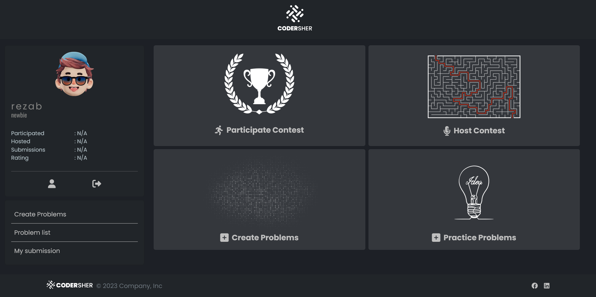

# Codersher - A online coding contest platform

Codersher is an online coding competition platform where user can create their own problem with custom test set and host new contest among others. Codersher provides a variety of different coding problems with different languages. It has built in Integrated development environments with compiler. User can submit and save their solution here. Codersher provides a variety of of security features too.

> **_Note:_** This project is made for my **_Computer Security_** course **_Spring 2023_**. **_Instructor_: [Mohammad Shahriar Rahman Phd](https://cse.uiu.ac.bd/profiles/rahman-mohammad-shahriar/)**

## Features

### Basic features

- Create new problems.
- Add test cases for different problems.
- Practice problem.
- Integrated Development Environment for C, C++, Java with syntax highlighting.
- Compiler for C, C++, Java.
- (On development) Host contest.
- (On development) Verdict for contest.

### Security Features

- Strong password.
- 2 Step authentication via email and otp.
- Password hashing.
- SQL Injection prevention.
- Data encryption and decryption.
- CSRF form validation.

## Dependencies

- [Codemirror 5](https://codemirror.net/5/)
- [Ckeditor](https://ckeditor.com/ckeditor-4/)
- [Phpmailer](https://github.com/PHPMailer/PHPMailer)

> **_Note:_** You may need to change the compiler location for **_MINGW_** and **_jdk_** in _/src/logic/compiler.php_ in order to make system up and running.
